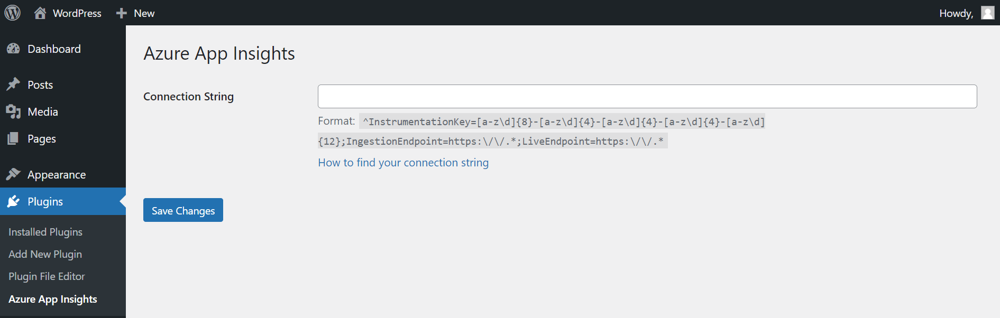

# Azure Application Insights for WordPress

### What's tracked:
1. Page Views
    * Page Title
    * Page URL
    * Duration
    * Referrer
    * URL Path 
    * Device Type: e.g. Browser
    * Device Model
    * Device OS
    * IP Address
    * Location: City
    * Location: StateOrProvince
    * Location: Country
    * Device Type Version
2. Browser Timings (how long the request takes to send and receive)
   * Page Title
   * Page URL
   * Duration Network Call: Completed
   * Duration Network Call: Send
   * Duration Network Call: Receive
   * Device Type: Browser
   * Device Type Version
   * Device OS
3. Custom Events (requires extra code)
   * Event Name
   * URL Path
   * Device Type: e.g. Browser
   * Device Model
   * Device OS
   * IP Address
   * Location: City
   * Location: StateOrProvince
   * Location: Country
   * Device Type Version
4. Dependencies
5. Browser Exceptions
   * Error Message
   * Error Script
   * Error Stack Trace
   * URL Path
   * Device Type: e.g. Browser
   * Device Model
   * Device OS
   * IP Address
   * Location: City
   * Location: StateOrProvince
   * Location: Country
   * Device Type Version
5. Performance Counters
6. Requests
7. Traces
   * Message
   * Severity Level
   * URL Path
   * Device Type: e.g. Browser
   * Device Model
   * Device OS
   * IP Address
   * Location: City
   * Location: StateOrProvince
   * Location: Country
   * Device Type Version

---

Javascript snippet taken from:

https://github.com/microsoft/ApplicationInsights-JS
