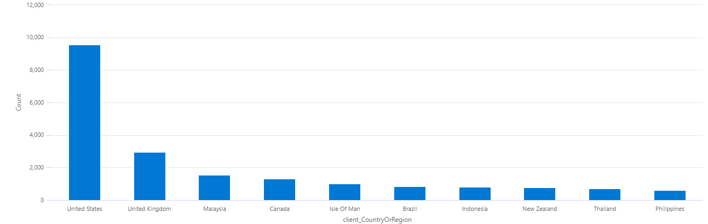
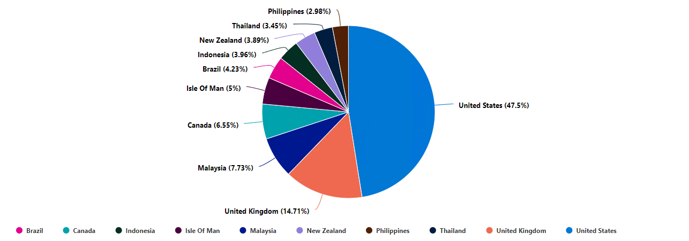
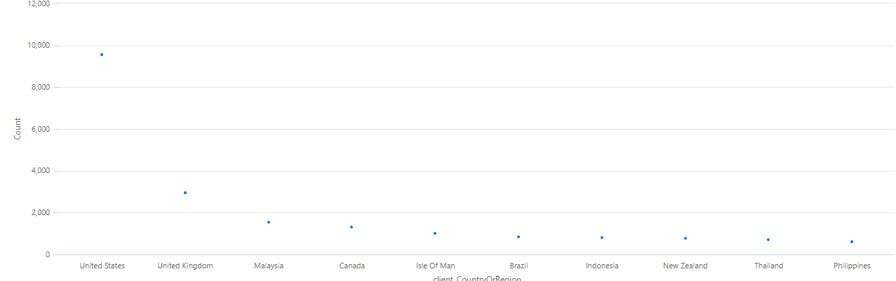
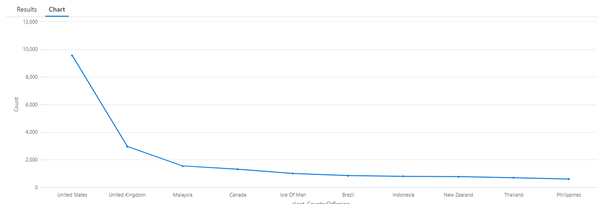

# Snippets for App Insights

### Top 10 visitor countries
```
pageViews
| summarize Count = count() by client_CountryOrRegion
| order by Count desc
| top 10 by Count desc
| render piechart 
```

---

### Types of Charts

| Chart   | Visual                                |
|---------|---------------------------------------|
| Area    |        |
| Bar     |          |
| Column  |    |
| Pie     |          |
| Scatter |  |
| Table   |      |
| Time    |       |
| Treemap | Unsupported                           |

---

### Custom Events

```javascript
function trackCustomEvent(eventName, customData = {}) {
    if (!window.appInsights || !window.appInsights.trackEvent) {
        return;
    }
    const eventData = {
        ...{name: eventName},
        ...customData
    }
    appInsights.trackEvent(eventData);
}

trackCustomEvent('MyCustomEvent');
```

ref: https://learn.microsoft.com/en-us/azure/azure-monitor/app/api-custom-events-metrics


---

### Dashboards

1. Enable App Insights for your resources
2. Create the Queries
3. Once you've got your query
4. Click "Pin to" dropdown
5. Click "Azure dashboard"
6. Click "Existing Tab" -> "Shared" radio button
7. Choose your subscription
8. Choose your dashboard