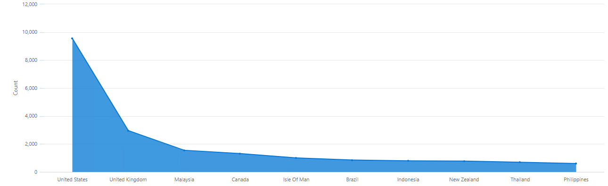
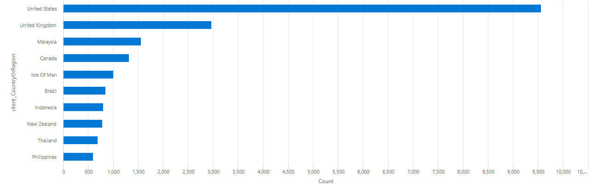
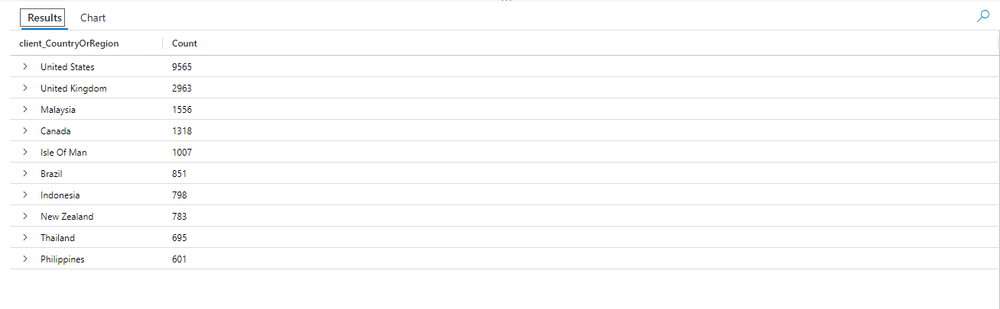
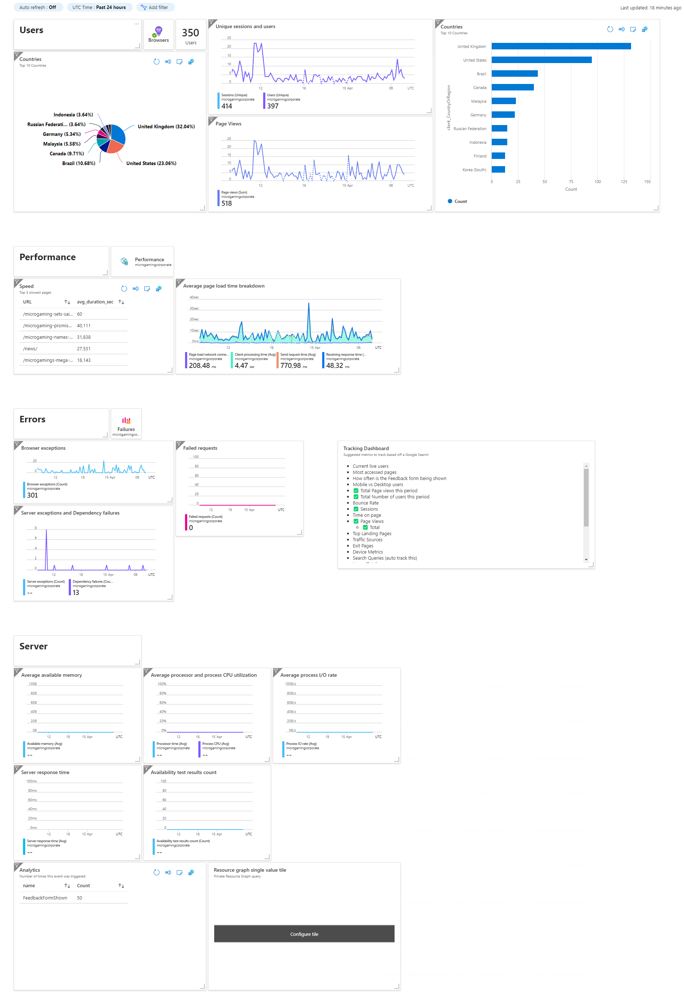

# Snippets for App Insights

* [Top 10 visitor countries](queries/top-10-countries.md)

---

### Types of Charts

| Chart   | Visual                                |
|---------|---------------------------------------|
| Area    |        |
| Bar     |          |
| Column  |    |
| Pie     |          |
| Scatter |  |
| Table   |      |
| Time    |       |
| Treemap | Unsupported                           |

---

### Track Custom Events

In Javascript:
```javascript
const your_custom_data_object = {};

appInsights.trackEvent({
    ...{name: 'your_event_name'},
    ...{your_custom_data_object}
});
```

ref: https://learn.microsoft.com/en-us/azure/azure-monitor/app/api-custom-events-metrics


---

### Dashboards

An example dashboard export is available [here](./dashboard.json):



1. Enable App Insights for your resources
2. Create the Queries
3. Once you've got your query
4. Click "Pin to" dropdown
5. Click "Azure dashboard"
6. Click "Existing Tab" -> "Shared" radio button
7. Choose your subscription
8. Choose your dashboard